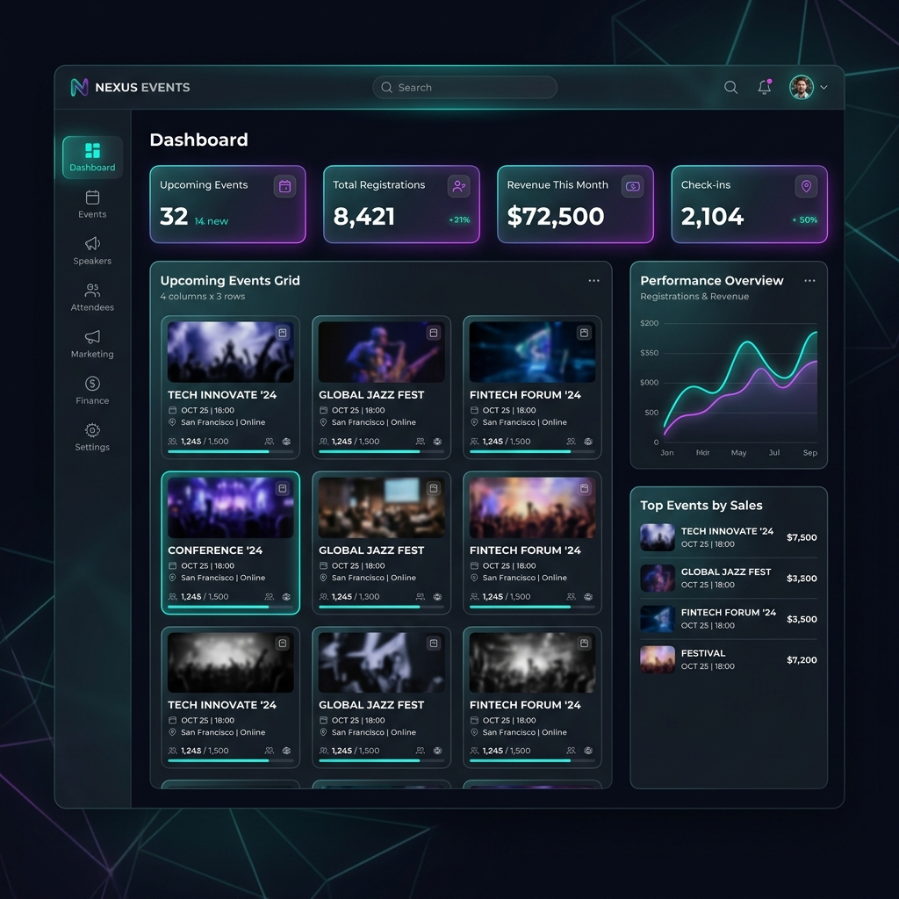

# Aether Events - MERN Event Management Portal

Welcome to the **MERN Event Management Portal**! This is a state-of-the-art, feature-rich web application built from scratch to allow users to explore, register for, and manage events. It is built using the **MERN Stack** (MongoDB, Express, React, Node.js) and features a premium glassmorphic UI.

---

## 🎨 Application Preview


---

## 🎓 Intern Information
- **Intern ID**: CITS7334
- **Full Name**: RUPAL AGARWAL
- **Role**: Full Stack Web Development Intern
- **Organization**: CodTech IT Solutions

---

## ✨ Features

1. **Integrated MERN Stack**:
   - **Database**: MongoDB storage of events and registration data using Mongoose schemas.
   - **Server**: Express.js REST API providing clean CORS headers and input verification.
   - **Client**: Vite-based React interface with structured state, component hierarchy, and dynamic UI lifecycle.
   - **Offline Fallback**: Seamless simulation of database persistence using an in-memory array database if the MongoDB service is unreachable.

2. **Premium Responsive Dashboard**: 
   - Summary statistics cards (Total Events, Active Registrations, Total Revenue, Available Tickets) queried from backend collections.
   - Dynamic interactive SVG-based charts visualizing registration trends and event category distributions.
   - Quick-action buttons for creating events.

3. **Event Explorer**:
   - Live query searching matching event titles, descriptions, categories, or tags.
   - Filtering buttons by category (Conferences, Webinars, Workshops, Meetups, Parties).
   - Date range boundaries filter.
   - Sorting options (Upcoming date, low pricing, high pricing, capacity occupancy).

4. **Event Management (CRUD)**:
   - Full REST endpoints mapping GET, POST, PUT, and DELETE operations.
   - Manage Events tab with structured lists, edit buttons, and cascade deletes (automatically purges registrations when deleting events).

5. **Dynamic Ticket Pass Generator**:
   - Frosted glass modal with registration fields.
   - Automated seat capacity validations.
   - Boarding-pass styled digital ticket rendering, featuring unique simulated SVG QR code modules and price tags.

6. **Attendee Directory**:
   - Searchable directory of event registration passes.
   - Immediate check-in status toggler connecting API endpoints in real-time.

7. **Aesthetics & Micro-interactions**:
   - Unified glassmorphic styles (`backdrop-filter`) with custom neon glow configurations.
   - Light & Dark mode settings saved on reload.
   - Animated SVG vectors ensuring dependency-free icon loading.

---

## 📁 File Structure
```
event-management-portal/
├── package.json        # Root script conductor (concurrently configuration)
├── README.md           # Project documentation and intern credentials
├── backend/
│   ├── package.json    # Backend configuration (Express, Mongoose, nodemon)
│   ├── server.js       # Main server entry, controllers, and mock db fallbacks
│   ├── config/
│   │   └── db.js       # MongoDB Mongoose connector helper
│   ├── models/
│   │   ├── Event.js    # Event schema definition
│   │   └── Registration.js # Registration schema definition
│   └── .env            # Environment config (MONGO_URI, PORT)
└── frontend/
    ├── package.json    # Frontend React dependencies configuration
    ├── vite.config.js  # Vite settings and local dev backend proxy config
    ├── index.html      # Frontend HTML template & SVG icons sheet
    └── src/
        ├── main.jsx    # React client mounting node
        ├── App.jsx     # Core React UI router, states, API links, and subviews
        └── App.css     # Premium styling sheet (Variables, glassmorphism config)
```

---

## 🚀 Setup & Startup Guide

Follow these quick commands to get the portal running locally:

### Prerequisites
Make sure you have **NodeJS** installed. MongoDB is highly recommended, but not strictly required (the server will fall back to in-memory simulation gracefully if MongoDB is unavailable).

### Step 1: Install All Dependencies
Open a command prompt in the root of the project folder (`event-management-portal`) and run:
```bash
npm run install-all
```
*This command executes recursive package installs for the root, backend, and frontend directories.*

### Step 2: Start Development Servers
From the root folder, launch both the frontend client and backend Express server concurrently:
```bash
npm run dev
```
- **Backend Server** will boot on: `http://localhost:5000`
- **Vite React Frontend** will boot on: `http://localhost:5173`

Open your web browser and navigate to **`http://localhost:5173`** to test the system!
